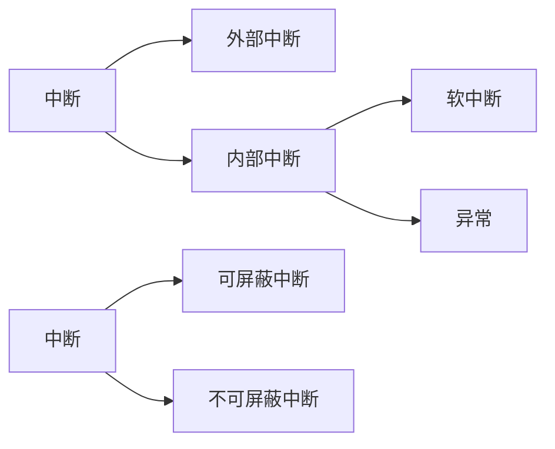

# 中断

由于 CPU 获知了计算机中发生的某些事，CPU 暂停正在执行的程序，转而去执行处理该事件的程序，
当这段程序执行完毕后，CPU 继续执行刚才的程序。整个过程称为中断处理，也称为中断。

并发：并发指的是单位时间内的累计工作量

并行：并行是指真正同时进行的工作量

## 操作系统是中断驱动的

> 没有中断，操作系统几乎什么都做不了，操作系统是中断驱动的

最后添加循环代码(jmp$)，仅仅是保证操作系统能够周而复始地运行下去，而运行的目的是为了等候某些事件的发生。

操作系统是被动工作的，有事情发生他才会工作，他是时间驱动的，而这个事件是以中断的形式通知操作系统的。

## 中断分类



### 外部中断

外部中断是指来自CPU外部的中断，外部的中断源必须是某一个硬件，所以外部中断又称为硬件中断.

由于外设的拓展以及数量，不可能对每一个外设准备一个引脚接收。所以一种可行的方法是CPU 提供统一的接口作为中断信号的公共线路，所有来自外设的中断信号都共享公共线路连接到 CPU。

`CPU`为大家提供了两条信号线。外部硬件的中断是通过两根信号线同志CPU的，这两根信号线就是**`INTR(INTeRrupt)`和`NMI(Non Maskable Interrupt)`**.


在CPU上运行的程序都是串行的，所有任务，包括中断处理程序都是一个接一个在CPU上运行的;所有任务都共享一个CPU。

**只要是从`INTR`引脚接收到的中断都是不影响系统运行的，可以随时处理(可以通过eflags寄存器的IF位将所有这些外部设备的中断屏蔽)**

**只要是从`NMI`引脚收到的中断，基本上全是硬伤，CPU没有运行下去的必要了**

Linux将中断处理程序分为`上半部(必须要执行的)`和`下半部(不着急执行的)`。

CPU收到中断后，得知道发生了什么事情才能执行相应的处理办法。这是通过中断向量表或中断描述符表(中断向量表是实模式下的中断处理程序数组，在保护模式下已经被中断描述符表代替).

1. 为每一个中断分配一个中断号(中断号就是一个整数)
2. 中断号就是中断向量表或中断描述符表中的索引下标，用来索引中断项
3. 中断发起时，相应的中断号通过`NMI`和`INTR`引脚传入CPU
4. CPU根据中断号找到对应的中断处理程序

可屏蔽中断不会导致致命的问题，他的数量有限，所以可以每一种中断源都可以获得一个中断向量号。

而不可屏蔽中断引起的致命原因很多，且出现了基本上软件解决不了，所以不可屏蔽中断统一分配一个中断号**2**

### 内部中断

内部中断可以分为`软中断`和`异常`

软中断，就是软件主动发起的，来自于软件，所以称之为软件。

* **`int 8`** 通过它进行系统调用(8位立即数可表示256位中断)
* **`int3`** 调试断点指令(机器码0xcc)
* **`into`** 中断溢出指令，中断向量号为4.(需要看`eflags`标志寄存器中的OF位是否为1)
* **`bound`** 检查数组索引越界指令，中断向量号为5.

> ​	格式："bound 16/32位寄存器"，"bound 16/32位内存"

目的操作数是用寄存器来存储的，其内容是待检测的数组下标值。源操作数是内存，其内容是数组下标的下边界和上边界。当执行 bound 指令时，若下标处于数组索引的范围之外，则会触发 5 号中断

* **`ud2`** 未定义指令，中断向量号为6.

**以上除第一种外，其余称为`异常`**。

是否无视`eflags`中的`IF`位:

1. 首先，只要是导致运行错误的中断类型都会无视 IF 位，不受 IF 位的管束，如 NMI、异常
2. 其次，由于 int n 型的软中断用于实现系统调用功能，不能因为 IF 位为 0 就不顾用户请求，所以为了用户功能正常，软中断必须也无视 IF 位

中断只要关系到"正常"运行，就不管。

#### 异常

异常按照轻重程度可以分为：

* Fault 也称为故障。

​	这种错误是可以被修复的，发生此类异常时，CPU将机器状态恢复到异常之前的状态，之后调用中断处理程序时，CPU将返回地址依然指向导致`fault`异常的那条指令。

​	通常中断处理程序会将问题修复，待中断处理程序返回后便可以重试。

* Trap 也称为陷阱。

​	此异常通常用于调试中，例如：`int3`

​	CPU将中断处理程序的返回地址指向导致异常指令的下一条指令

* Abort 也称为终止。

​	这是最严重的异常类型，一旦出现，程序无法运行，操作系统为了自保，将此程序从进程表中去掉。


`Error code`字段，如果值为`Y`，表示相应中断会CPU压入错误码。


中断机制的本质就是来了一个中断信号后，调用相应的处理程序。因此不管有多少种类型的中断，为了统一管理，为每一个中断号分配一个整数，用此整数作为中断的`ID`，用此`ID`作为中断描述符表的索引，这样找到对应的表项，从而找到对应的中断处理程序。

异常和不可屏蔽中断的中断号是由CPU自动提供的，来自设备外的可屏蔽中断号是由中断代理提供的，软中断是由软件提供的。

## 中断描述符表

中断描述符表(**`Interrupt Descriptor table,IDT`**).是保护模式下用于存储中断处理程序入口的表。

中断描述符表中的描述符的名称------门


在实模式中，位于地址`0~0x3fff`的是中断向量表`IVT`，IVT共1KB(1024字节)，可容纳256个中断向量。因此每个中断向量用4字节描述。

中断描述符表与中断向量表的两个区别：

* 中断描述符表地址不限制，在那里都可以
* 中断描述符表的每一个描述符用`8`字节描述

在CPU内部有一个中断描述符表寄存器(**`Interrupt Descriptor Table Register,IDTR`**),该寄存器分为两部分

1. 第0～15位是表界限，即IDT大小减**1**
2. 第16～47位是IDT的基地址


16位的表界限，表示最大范围为`0xffff`，即64KB.可容纳64kb/8=8kb(8192个)。但处理器只支持256个中断，其余不可用。

特别注意的是`GDT`中的第0个描述符不可用，但是`IDT`中却没有该限制，第0个中断是除法错。

**同加载GDTR一样，加载IDTR也有专门的指令---`lidt`**：

```assembly
lidt 48位内存数据
;前16位是IDT表界限，后32位是IDT线性基地址
```

### 中断处理过程及保护

完整的中断过程分为`CPU外`和`CPU内`两部分

CPU外：外部设备的中断有中断代理芯片接收，处理后将该中断的中断向量号发送到CPU

CPU内：CPU执行该中断向量号对应的中断处理程序

1. 处理器根据中断向量号**定位**中断描述符
   1. 由于中断描述符是8字节，所以处理用 **中断号*8**
   2. 在于`idtr`中的内容**相加**，地址之和就是对应的中断描述符
2. 处理器进行**特权级检查**
   1. 中断向量号只是个整数，所以没有RPL(请求特权级)
   2. 中断门的特权检查同调用门类似，对于软件发起的**软中断**，当前特权级CPL必须在**门描述符DPL**和门中**目标代码的DPL之间**。
      1. 如果是有软中断`int n`、`int3`和`into`引发的中断,这是由用户进程主动发起的中断，由用户代码控制。处理器检查当前特权级CPL与门描述符DPL,**数值上**CPL<=门描述符DPL。门槛通过
      2. 进一步**检查上限(门框)**:处理器检查**当前特权级CPL**和**门描述符中所记录的选择子对应的目标代码段的DPL**，**数值上**CPL>DPL.检查通过。如果**CPL>=DPL，处理器将引发异常**。
      3. 若中断是由外部设备和异常引起的，则只检查CPL和目标代码段DPL,是一样的。
3. 执行中断处理程序
   1. 特权检查通过后，将门描述符目标代码段选择子**加载到代码段寄存器`CS`中**，把**门描述符中中断处理程序的偏移地址加载到`EIP`**


中断发生后，`eflags`寄存器中的**NT**和**TF**位会被置0.

如果是`中断门`：**IF**位被自动置0，避免嵌套中断。

若中断发生时对应的是`任务门`或`陷阱门`的话，不需要将**IF**位置0.因为陷阱门主要用于调试，它允许 CPU 响应更高级别的中断，所以允许中断嵌套。而对任务门来说，这是执行一个新任务，任务都应该在开中断的情况下进行，否则就独占 CPU 资源，操作系统也会由多任务退化成单任务了.


从中断处返回的指令是`iret`，从栈中弹出数据到寄存器`cs、eip、eflags`，根据特权级判断是否要恢复旧栈。也就是是否将栈中位于`SS_old`和`ESP_old`位置弹出到寄存ss和esp。中断处理程序完成后，使用`iret`指令从**栈中恢复**eflags.

有些`eflags`中的位需要pushf压入到栈中修改后在弹回的方式修改，这样有内存参与的操作必然是低效率，而且不是原子操作。

原子性就是所有的步骤一次性全部完成，中间不可被打断。所以处理器提供了专门处理**IF**位的指令。

```assembly
cit 		;使IF位置为0，忽略可屏蔽中断		关中断
sit			;使IF位置为1					 开中断		
```

IF 位只能限制外部设备的中断，对那些影响系统正常运行的中断都无效，如异常 exception，软中断，如 int n 等，不可屏蔽中断 NMI 都不受 IF 限制

**`TF(Trap Flag)`** 		陷阱标志位，置0表示禁止单步执行，也就是进入中断后TF置为0,表示不允许中断处理程序单步执行

**`NT(Nest Task Flag)`**       任务嵌套标志位	任务嵌套是指将当前执行的旧任务挂起，转而去执行新的任务，新的任务执行完后，在回到旧任务继续执行

在执行新任务之前，CPU做了两件准备工作：

1. 将旧任务 TSS 选择子写到了新任务 TSS 中的“上一个任务 TSS 的指针”字段中
2. 将新任务标志寄存器 eflags 中的 NT 位置 1，表示新任务之所以能够执行，是因为有别的任务调
   用了它。

CPU 把新任务执行完后还是要回去继续执行旧任务的通过 iret 指令。

iret 指令因此有两个功能：

* 从中断返回
* 返回到调用自己执行的那个旧任务这也相当于执行一个任务。

那么问题来了，对同一条 iret 指令，CPU 是如何知道该从中断返回呢，还是返回到旧任务继续执行呢？这就用到 NT 位了

* 当 CPU 执行 iret 时，它会去检查 NT 位的值，如果 NT 位为 1，这说明当前任务是被嵌套执行的，因此会从自己 TSS 中“上一个任务 TSS 的指针”字段中获取旧任务，然后去执行该任务。
* 如果 NT 位的值为 0，这表示当前是在中断处理环境下，于是就执行正常的中断退出流程。

### 中断发生时的压栈

处理器不管新的选择子和任何段寄存器（包括 CS）中当前的选择子是否相同，也不管这两个选择子是否指向当前相同的段，只要段寄存器被加载，段描述符缓冲寄存器就会被刷新，处理器都认为是换了一个段，属于段间转移，也就是远转移

不同特权级下处理器使用不同的栈，至于中断处理程序使用哪一个栈，要视当时所在的特权级。除了要保存CS、EIP 外，还需要保存标志寄存器 EFLAGS，如果涉及到特权级变化，还要压入 SS 和 ESP 寄存器。

（1）处理器找到对应的中断描述符后，**拿 CPL 和中断门描述符中**选择子对应的目标代码段的 **DPL 比对**，若 CPL 权限比 DPL 低，即数值上 CPL > DPL，这表示要向高特权级转移，需要切换到高特权级的栈。这也意味着当执行完中断处理程序后，若要正确返回到当前被中断的进程，同样需要将**栈**恢复为此时的**旧栈**。于是处理器先临时保存当前**旧栈 SS 和 ESP 的值**，记作 **SS_old 和 ESP_old**，然后在TSS 中找到**同目标代码段 DPL 级别相同的栈加载到寄存器 SS 和 ESP 中，记作 SS_new 和 ESP_new**，再将之前临时保存的 SS_old 和 ESP_old 压入新栈备份，以备返回时重新加载到栈段寄存器 **SS 和栈指针 ESP**。由于 SS_old 是 16 位数据，32 位模式下的栈操作数是 32 位，所以将 SS_old 用 0 扩展其高 16 位，成为 32位数据后入栈。此时新栈内容如图 7-8 中 A 所示。
（2）在新栈中压入 EFLAGS 寄存器，新栈内容如图 7-8 中 B 所示。
（3）由于要切换到目标代码段，对于这种段间转移，要将 **CS 和 EIP** 保存到当前栈中备份，记作 CS_old和 EIP_old，以便中断程序执行结束后能恢复到被中断的进程。同样 CS_old 是 16 位数据，需要用 0 填充其高 16 位，扩展为 32 位数据后入栈。此时新栈内容如图 7-8 中 C 所示。当前栈是新栈，还是旧栈，取决于第 1 步中是否涉及到特权级转移。
（4）某些异常会有错误码，此错误码用于报告异常是在哪个段上发生的，也就是异常发生的位置，所以错误码中包含选择子等信息，一会介绍。错误码会紧跟在 EIP 之后入栈，记作 ERROR_CODE。此时新栈内容如图 7-8 中 D 所示。


Iret，即 interrupt ret，此指令专用于从中断处理程序返回，假设在 32 位模式下，它从当前栈顶处依次弹出32 位数据分别到寄存器 EIP、CS、EFLAGS。

所以在使用 `iret`(中断处理程序的最后一个指令) 之前，一定要保证栈顶往上的数据是正确的，且从栈顶往上的顺序是 EIP、CS、EFLAGS，根据特权级是否有变化，还有 ESP、SS.

由于寄存器是16位的，从栈中返回32位数据，高16位会被丢弃。

同类型的指令患有`iretw`和`iretd`，16模式用前者，32位模式下用后者，iret是两者的简写。

处理器在返回到被中断过程中的特权检查：

1. 当处理器执行到 iret 指令时，它知道要执行远返回，首先需要从栈中返回被中断进程的代码段选
   择子 CS_old 及指令指针 EIP_old。这时候它要进行特权级检查。先检查栈中 CS 选择子 CS_old，根据其
   RPL 位，即未来的 CPL，判断在返回过程中是否要改变特权级
2. 栈中 CS 选择子是 CS_old，根据 CS_old 对应的代码段的 DPL 及 CS_old 中的 RPL 做特权级检查，
   规则不再赘述。如果检查通过，随即需要更新寄存器 CS 和 EIP。由于 CS_old 在入栈时已经将高 16 位扩
   充为 0，现在是 32 位数据，段寄存器 CS 是 16 位，故处理器丢弃 CS_old 高 16 位，将低 16 位加载到 CS，
   将 EIP_old 加载到 EIP 寄存器，之后栈指针指向 EFLAGS。如果进入中断时未涉及特权级转移，此时栈指
   针是 ESP_old（说明在之前进入中断后，是继续使用旧栈）。否则栈指针是 ESP_new（说明在之前进入中
   断后用的是 TSS 中记录的新栈）。
3. 将栈中保存的 EFLAGS 弹出到标志寄存器 EFLAGS。如果在第 1 步中判断返回后要改变特权级，
   此时栈指针是 ESP_new，它指向栈中的 ESP_old。否则进入中断时属于平级转移，用的是旧栈，此时栈指
   针是 ESP_old，栈中已无因此次中断发生而入栈的数据，栈指针指向中断发生前的栈顶
4. 如果在第 1 步中判断出返回时需要改变特权级，也就是说需要恢复旧栈，此时便需要将 ESP_old
   和 SS_old 分别加载到寄存器 ESP 及 SS，丢弃寄存器 SS 和 ESP 中原有的 SS_new 和 ESP_new，同时进行
   特权级检查。补充，由于 SS_old 在入栈时已经由处理器将高 16 位填充为 0，现在是 32 位数据，所以在
   重新加载到栈段寄存器 SS 之前，需要将 SS_old 高 16 位剥离丢弃，只用其低 16 位加载 SS。

### 中断错误码


**`EXT`**表示`EXTernal evebt`，即外部事件，用来指明中断源是否来自处理器外部，如果中断源是不可屏蔽中断`NMI`或外部设备，EXT=1,else = 0;

IDT 表示选择子是否指向中断描述符表 IDT，IDT 位为 1，则表示此选择子指向中断描述符表，否则指向全局描述符表 GDT 或局部描述符表 LDT。
TI 和选择子中 TI 是一个意思，为 0 时用来指明选择子是从 GDT 中检索描述符，为 1 时是从 LDT 中检索描述符。当然，只有在 IDT 位为 0 时 TI 位才有意义.

选择子高 13 位索引就是选择子中用来在表中索引描述符用的下标。

## 可编程中断控制器8259A

可屏蔽中断的代理---可编程中断控制器8259A

8259A 用于管理和控制可屏蔽中断，它表现在屏蔽外设中断，对它们实行优先级判决，向CPU提供中断向量号等功能。

Intel 处理器共支持 256 个中断，但 8259A 只可以管理 8 个中断，所以它为了多支持一些中断设备，提供了另一个解决方案，将多个 8259A 组合，官方术语就是**级联**。若采用级联方式，即多片 8259A 芯片串连在一起，最多可级联**9 **个，也就是最多支持 **64** 个中断。 n 片 8259A 通过级联可支持**7n+1** 个中断源，级联时只能有一片 8259A
为主片 master，其余的均为从片 slave。来自从片的中断只能传递给主片，再由主片向上传递给 CPU，也就是说只有主片才会向 CPU 发送 INT 中断信号。


* INT：8259A 选出优先级最高的中断请求后，发信号通知 CPU。
*  INTA：`INT Acknowledge`，中断响应信号。位于 8259A 中的 INTA 接收来自 CPU 的 INTA 接口的
  中断响应信号。
*  IMR：`Interrupt Mask Register`，中断屏蔽寄存器，宽度是 8 位，用来屏蔽某个外设的中断。
*  IRR：`Interrupt Request Register`，中断请求寄存器，宽度是 8 位。它的作用是接受经过 IMR 寄存器过
  滤后的中断信号并锁存，此寄存器中全是等待处理的中断， “相当于”5259A 维护的未处理中断信号队列。
*  PR：`Priority Resolver`，优先级仲裁器。当有多个中断同时发生，或当有新的中断请求进来时，将
  它与当前正在处理的中断进行比较，找出优先级更高的中断。
*  ISR： `In-Service Register`，中断服务寄存器，宽度是 8 位。当某个中断正在被处理时，保存在此寄存器中。

工作流程：

1. 主办将信号**通路**指向`8259A`芯片的某一个**`IRQ`**接口
2. 首先**检查**IMR寄存器是否已经屏蔽来自该IRQ接口的中断信号(1屏蔽丢弃0放行)
3. 将该IRQ接口所在`IRR`寄存器中对应的**BIT**置1.(IRR寄存器的作用“相当于”待处理中断队列)
4. 在某一个时机，优先级仲裁器`PR`会从`IRR`寄存器中**挑选**一个优先级最大的中断.(接口号越低，优先级越高)
5. 通过INT接口向CPU发送`INTR`信号。
6. .........CPU通过自己的`INTA`接口向8259A的`INTA`接口**回复**一个中断响应信号。
7. `8259A`收到这个信号后，将刚才挑选出来的中断在`ISR`寄存器中对应的`BIT`**置1**.同时从`IRR`中**去**掉。
8. 之后CPU将再次发送`INTA`信号给8259A,用来获取中断对应的中断向量号(起始中断向量号+IRQ接口号)。
9. 将中断向量号通过系统数据总线发送给CPU.

如果`8259A`的“EOI通知(End of Interrupt)”被设置为非自动模式，中断处理程序结束出必须有向`8259A`发送EOI的代码，在收到后，将正在处理的中断在`ISR`寄存器中对应置BIT0.

自动模式时，在第二次接收`INTA`信号后自动设置0.

### 8259A的编程

在**8259A**内部有两组寄存器：

* 初始化命令寄存器组，用来保存初始化命令字(Initialization Command Words,ICW)共四个，ICW1~ICW4
* 操作命令寄存器组，用来保存操作命令字(Operation Command Word,OCW)共三个，OCW1~OCW3

编程分为两部分：

* 初始化：必须依次写入ICW1、ICW2、ICW3、ICW4
* 操作: OCW发送顺序不固定

#### ICW


#### OCW


ICW1和OCW2、OCW3是用偶地址端口0x20(主片)或0xA0(从片)写入

ICW2~ICW4和OCW1是用奇地址端口0x21(主片)或0xA1(从片)写入


## 编写中断处理程序

> %macro 宏名字参数个数
>
> ​	...
>
> ​	宏代码体
>
> ​	...
>
> %endmacro

```assembly
%macro mul_add3
	mov eax, %1
	add eax, %2
	add eax, %3
%endmacro

mul_add 45, 24, 33	;其中%1是45, %2是24, %3是33
```


1. 用汇编语言实现中断处理程序
2. 创建中断描述符表**`IDT`**，安装中断处理程序
3. 用内联汇编实现端口I/O函数
4. 设置8259A
5. 加载IDT


### 处理器进入中断时压栈出栈完整过程

在 bochs 中，当执行了 show int 指令时，当有中断发生时，控制台会打印出中断发生的相信信息，信息包括。

* 发生中断时执行了多少条指令，即指令数时间戳。
*  中断类型，即硬件中断，还是软中断，或是 iret 指令引起的中断。

bochs 中提供了利用指令数做断点的指令，就是 sba 或 sb，这两个断点指令是有区别的。
sb 的参数是指令数的增量，即以当前指令为准，再执行多少个指令后停下来。
sba 的参数是指令数的绝对量，也就是指令数的总量，即从处理器加电后总共执行多少条指令后停下来。

## 可编程计数器/定时器8253简介

计算机中的时钟，大致上可以分为两大类：内部时钟和外部时钟

**内部时钟**是指处理器中内部元件，如运算器、控制器的工作时序，主要用于控制、同步内部工作过程的步调

内部时钟是由处理器固件结构决定的，在出厂时就设定好啦，无法改变。处理器内部元件的工作速度是最快的，所以内部时钟的时间单位粒度比较精细，通常都是纳秒（ns）级的。

**外部时钟**是指处理器与外部设备或外部设备之间通信时采用的一种时序，比如 IO 接口和处理器之间在 A/D 转换时的工作时序、两个串口设备之间进行数据传输时也要事先同步时钟等.

外部时钟和内部时钟是两套独立运行的定时体系，他们按照自己的步调协同工作。

### 8253入门


计数器0～2,端口分别是0x40～0x42.计数器又称为通道，每个计数器都完全相同，都是16位大小。

他们三个计数器的工作是不依赖的，各个计数器都有自己的一套寄存器资源(16位的计数初值寄存器、计数执行部件、输出锁存器)。

（1）CLK 表示时钟输入信号，即计数器自己工作的节拍，也就是计数器自己的时钟频率。每当此引
脚收到一个时钟信号，减法计数器就将计数值减 1。 连接到此引脚的脉冲频率最高为 10MHz， 8253 为 2MHz。
（2）GATE 表示门控输入信号，在某些工作方式下用于控制计数器是否可以开始计数，在不同工作方
式下 GATE 的作用不同，到时候同工作方式一同介绍。
（3）OUT 表示计数器输出信号。当定时工作结束，也就是计数值为 0 时，根据计数器的工作方式，
会在 OUT 引脚上输出相应的信号。此信号用来通知处理器或某个设备：定时完成。这样处理器或外部设
备便可以执行相应的行为动作。


### 8253控制字

控制字寄存器也称为模式控制寄存器。暂称为控制模式。


### 8253工作方式


计数器开始计数需要两个条件：

1. GATE为高电平，即GATE为1,这是由硬件来控制的
2. 计数初值已写入计数器中的减法计数器，这是由软件out指令控制的

当两个条件满足后，计数器将在下一个时钟信号`CLK`的下降沿开始计数


​		1193180/计数器 0 的初始计数值=中断信号的频率
所以：
​		1193180/中断信号的频率=计数器 0 的初始计数值

### 8253初始化步骤

1. 往控制字寄存器端口0x43中写入控制字
2. 在所指定使用的计数器端口写入计数初值

计数初值要**写入**所使用的计数器所在的**端口**，即若使用**计数器 0**，就要把计数初值往 **0x40 端口**写入，
若使用的是**计数器 1**，就要把计数初值往 **0x41** 端口写入，依次类推。计数初值寄存器是 16 位，高 8 位和
低 8 位可单独使用，所以初值是 8 位或 16 位皆可。若初值是 8 位，直接往计数器端口写入即可。若初值
为 16 位，必须分两次来写入，先写低 8 位，再写高 8 位。

## 提高时钟中断的频率


（1）counter_port 是计数器的端口号，用来指定初值 counter_value 的目的端口号。
（2）counter_no 用来在控制字中指定所使用的计数器号码，对应于控制字中的 SC1 和 SC2 位。
（3）rwl 用来设置计数器的读/写/锁存方式，对应于控制字中的 RW1 和 RW0 位。
（4）counter_mode 用来设置计数器的工作方式，对应于控制字中的 M2～M0 位。
（5）counter_value 用来设置计数器的计数初值，由于此值是 16 位，所以我们用了 uint16_t 来定义它。
